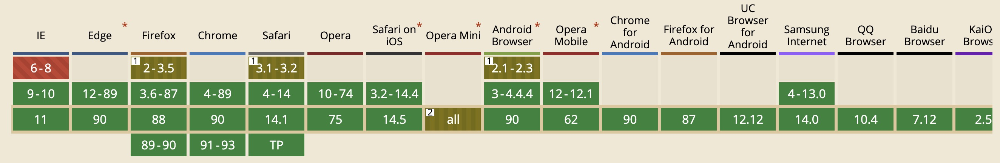

## 简介

1. 定义

`<canvas>` 元素可被用来通过JavaScript（Canvas API 或 WebGL API）绘制图形及图形动画。[详见](https://developer.mozilla.org/en-US/docs/Web/HTML/Element/canvas)

2. 兼容性



## 基本使用

```html
<canvas id="canvas">
  抱歉，您的浏览器不支持canvas元素
  （这些内容将会在不支持<canvas>元素的浏览器或是禁用了JavaScript的浏览器内渲染并展现）
</canvas>
```

```js
const canvas = document.getElementById('canvas');
// 上下文环境，真实绘制的接口
const context = canvas.getContext('2d');

if(context) {
  // do sth ... 
} else {
  alert('抱歉，您的浏览器不支持canvas元素');
}
```

1. 绘制直线

**Canvas 是基于状态的绘图**

```js
context.beginPath();
context.moveTo(100, 100);
context.lineTo(700, 700);
context.closePath();
context.stroke();

context.beginPath();
context.moveTo(200, 100);
context.lineTo(700, 600);
context.closePath();
context.stroke();
```

2. 绘制弧线 

`context.arc(x, y, radius, startAngle, endAngle, anticlockwise)` x | y 坐标，半径，起始点，终点，顺/逆时针 默认逆时针
