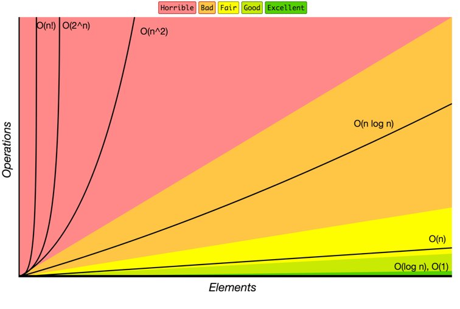

## Big O notation 回顾

### 什么是 Big O notation?

与硬件及环境无关的，用于衡量算法效率的数学模型。

### 常见的 Big O notation

* O(1) —— 简单运算，例如：加减乘除
* O(n) —— 遍历，例如：for 循环
* O(logn) —— 递归，例如：二分查找
* O(nlogn) —— 遍历和递归，例如：归并排序
* O(n^x) —— 嵌套循环



### 关于时间复杂度的心得

获得 O(1) 的时间复杂度，通常需要依靠数学知识

遍历的量级为 100 时，O(n^2) 是可接受的

### Object 常用方法时间复杂度：

* Object.keys() —— O(n)
* Object.values() —— O(n)
* Object.entries() —— O(n)
* delete Object.key —— O(1)

### Array 常用方法时间复杂度

* Array.push()，Array.pop() —— O(1)
* Array.shift() , Array.unshift() —— O(n)
* Array.concat() —— O(n)
* Array.sort() —— O(nlogn)
* Array.forEach()，Array.map()，Array.filter()，Array.reduce() —— O(n)

## 常见解题套路

### 如何解决算法题

1. 理解问题
   * 重述问题
   * 检查输入
   * 确认输出
      * 输入是否充分？不充分的话怎么办？
      * 输入中重要的部分是什么？

2. 举例子
   * 尝试简单的例子
   * 尝试复杂的例子
   * 尝试输入空值
   * 尝试输入无效值

3. 拆分问题
   * 分解步骤，用注释描述每一步要做什么

4. 解决/简化问题
   * 找出问题易解决和不易解决的部分
   * 解决易解决的部分
   * 解决不易解决的部分

### 常见模式

* Frequency Counter
* Pattern Matcher
* Sliding Window
* Multiple Pointer
* Divide and Conquer

1. Frequency Counter

核心思路：利用 Map 记录某个值出现的频率。

应用场景：涉及频率、重复性等问题时，可以套用该模式。

题目：编写一个函数 same，它接受两个数组 arr1 和 arr2。返回一个布尔值，如果 arr1 每一项的平方都能在 arr2 中找到，且频次一样，返回 true，否则返回 false。

```
same([1,2,3], [1,9,4])   // true
same([1,2,3], [1,9])   // false
same([1,2,1], [1,4,4])   // false
```

```js
// 普通解法
function same(arr1, arr2) {
   if (arr1.length !== arr2.length) return false;

   for (let i = 0; i < arr1.length; i++) {
      const targetIndex = arr2.indexOf(arr1[i] ** 2);
      if (targetIndex === -1) return false;
      arr2.splice(targetIndex, 1);
   }

   return true;
}

// Frequency Counter
function same(arr1, arr2) {
   if (arr1.length !== arr2.length) return false;

   const map = arr2.reduce((prev, cur) => {
      prev[cur] === undefined ? prev[cur] = 1 : prev[cur]++;
      return prev;
   }, {});

   for (let i = 0; i < arr1.length; i++) {
      const value = arr1[i] ** 2;
      if (map[value]) {
         map[value]--;
      } else {
         return false;
      }
   }

   return true;
}
```

2. Pattern Matcher

核心思路：利用栈来维护成对的匹配关系。遍历时，匹配的前半部分压入栈，遇到匹配的后半部分，将它从栈中抛出。

应用场景：涉及成对匹配、相邻去重的问题时，可以套用该模式。

题目：编写一个函数 isMatch，它接受一个字符串形式的运算公式。返回一个布尔值，如果公式中括号能正确匹配，返回 true， 否则返回 false。

```
isMatch('()[]{}');     // true
isMatch('([)]');       // false
isMatch('(]');         // false
```

```js
// Pattern Matcher
function isMatch(str) {
   const map = {
      '(': ')',
      '{': '}',
      '[': ']'
   }
   const stack = [];

   for (let char of str) {
      if (map[char]) {
         stack.push(map[char]);
      } else {
         const pop = stack.pop();
         if (pop !== char) return false;
      }
   }

   return stack.length === 0;
}
```

3. Sliding Window

核心思路：利用队列来维护一个「滑窗」，每有一个值进入「滑窗」，就有一个值从「滑窗」前面抛出。

应用场景：与子数组有关的问题都可尝试该模式。

题目：编写一个函数 maxSubarraySum，它接受一个数组 arr 和一个数字 num。返回长度为 num 的连续子数组所能得到的最大的和。

```
maxSubarraySum([1,2,3], 2)      // 5, 2+3
maxSubarraySum([3,2,1,8], 3)    // 11, 2+1+8
```

```js
// 普通解法
function maxSubarraySum(arr, n) {
   if (n > arr.length) return null;
   let max = -Infinity;

   for (let i = 0; i < arr.length - n + 1; i++) {
      let temp = 0;
      for (let j = 0; j < n; j++) {
         temp += arr[i + j];
      }
      console.log(temp, max)
      if (temp > max) {
         max = temp;
      }
   }

   return max;
}

// Sliding Window
function maxSubarraySum(arr, n) {
   if (n > arr.length) return null;
   let max = 0;
   let cur = 0;
   for (let i = 0; i < n; i++) {
      max += arr[i];
   }
   cur = max;
   for (let i = n; i < arr.length; i++) {
      cur = cur - arr[i - n] + arr[i];
      max = Math.max(max, cur)
   }
   return max;
}
```

4. Multiple Pointer

核心思路：利用多指针遍历数组，提供遍历效率。

应用场景：遍历已排序的数组时，可以套用该模式。

题目：编写一个函数 sumZero，它接受一个已排序的数组，数组中的项均为整数。返回数组中第一组和为 0 的两个项。如果没有这样的两个项，返回 undefined。

```
sumZero([-3,-2,-1,0,1,2,3])   // [-3,3]
sumZero([1,2,3])   // undefined
```


```js
// 普通解法
function sumZero(arr) {
   for (let i = 0; i < arr.length; i++) {
      for (let j = i + 1; j < arr.length; j++) {
         if (arr[i] + arr[j] === 0) {
            return [arr[i], arr[j]];
         }
      }
   }
}

// Multiple Pointer
function sumZero(arr) {
   let start = 0;
   let end = arr.length - 1;

   while (end > start) {
      const sum = arr[start] + arr[end];
      if (sum > 0) {
         end--;
      } else if (sum === 0) {
         return [arr[start], arr[end]];
      } else {
         start++;
      }
   }
}
```

5. Divide and Conquer

核心思路：将问题化解为一系列独立的子问题，通过解决这些子问题来获取全局的解。

应用场景：当问题可拆分为独立的子问题时，可以套用该模式。

题目：给数组排序

普通解法：冒泡排序

分治解法：归并排序

## 高阶算法分享

### 动态规划

使用子问题的解决方案构建全局的解决方案，后续步骤依赖前面的步骤

动态规划的核心

* 状态
* 状态转移方程
* 缓存

动态规划与分治的区别

* 动态规划中，子问题层层依赖，前一个子问题的解会影响下一个子问题的解。
* 分治算法中，子问题互相独立，互不影响。

题目1：你是一个专业的小偷，计划偷窃沿街的房屋。每间房内都藏有一定的现金，影响你偷窃的唯一制约因素就是相邻的房屋装有相互连通的防盗系统，如果两间相邻的房屋在同一晚上被小偷闯入，系统会自动报警。
给定一个代表每个房屋存放金额的非负整数数组，计算你 不触动警报装置的情况下 ，一夜之内能够偷窃到的最高金额。

**核心思想是：到了第i个房间时，要决定偷还是不偷；1. 偷的话 就是 nums[i] + dp[i-2]；2. 不偷的话就是 dp[i-1] 取两者最大收益即可**

**状态转移方程：`dp[i] = max(dp[i-1], nums[i-1] + dp[i-2])`**

```
rob([1,2,3,1])    // 4
rob([2,7,9,3,1])  // 12
```

```js
function rob(nums) {
  const len = nums.length;
  if (len === 0) {
    return 0;
  }
  const dp = new Array(len + 1);
  dp[0] = 0;
  dp[1] = nums[0];
  for (let i = 2; i <= len; i++) {
    dp[i] = Math.max(dp[i - 1], dp[i - 2] + nums[i - 1]);
  }
  return dp[len]
};
```

优化空间复杂度后

```js
function rob(nums) {
  let prev = 0;
  let cur = 0;

  for (let i = 0; i < nums.length; i++) {
    let temp = Math.max(cur, prev + nums[i]);
    prev = cur;
    cur = temp;
  }
  
  return cur;
}
```

题目2：给定一个整数数组 nums ，找到一个具有最大和的连续子数组（子数组最少包含一个元素），返回其最大和。

```
maxSubArray([-2, 1, -3, 4, -1, 2, 1, -5, 4]) // 6
```

**dp[i] = max(dp[i-1], 0) + nums[i-1]**

```js
const maxSubArray = function(nums) {
  const len = nums.length;
  const dp = new Array(len + 1);
  dp[0] = 0;

  for(let i = 1; i <= len; i++) {
    dp[i] = nums[i-1] + Math.max(dp[i-1], 0)
  }

  return Math.max(...dp);
};
```

优化空间复杂度后

```js
const maxSubArray = function (nums) {
  let cur = nums[0];
  let max = cur;

  for (let i = 1; i < nums.length; i++) {
    cur = Math.max(cur, 0) + nums[i];
    max = Math.max(max, cur);
  }

  return max;
};
```

题目3：如果我们有面值为 1 元、3 元和 5 元的硬币若干枚，如何用最少的硬币凑够 11 元？

```
dp[0] = 0;
dp[1] = dp[0] + 1;
dp[2] = dp[1] + 1;
dp[3] = min(dp[3 - 1] + 1, dp[3 - 3] + 1);
```

**状态转移方程：`dp[i] = min{ dp[i - v] + 1 }` i - v>= 0，v 表示第 coins 第 j 个硬币的面值。**

```js
const minCoins = function (coins, target) {
    const dp = new Array(target + 1).fill(Infinity);
    dp[0] = 0;
    for (let i = 1; i <= target; i++) {
        for (let coin of coins) {
            if (i >= coin) {
                dp[i] = Math.min(dp[i], dp[i - coin] + 1);
            }
        }
    }
    return dp[target]
}
```

### 贪心算法

选择子问题的最优解获得全局的最优解

贪心算法的核心

* 本质是分治算法
* 难点在于证明问题可以（或不能）用贪心算法

题目：从二维表的每行中选一个数，使它们的和最小。

```
[[1,2,3],[3,4,5],[3,4,5]]   // 1 + 3 + 3 = 7
```

### 动态规划在前端的应用

* 等宽瀑布流保持几列图片之间的高度差最小
   * 能否用贪心？
   * 为什么要用动态规划？
* 涉及等分、最优解的问题，都可以考虑动态规划

## 参考链接

[JavaScript 算法与数据结构](https://github.com/trekhleb/javascript-algorithms/blob/master/README.zh-CN.md)

[0-1背包问题](https://juejin.im/post/5affed3951882567161ad511)

[为什么我认为数据结构与算法对前端开发很重要？](https://github.com/LeuisKen/leuisken.github.io/issues/2)
